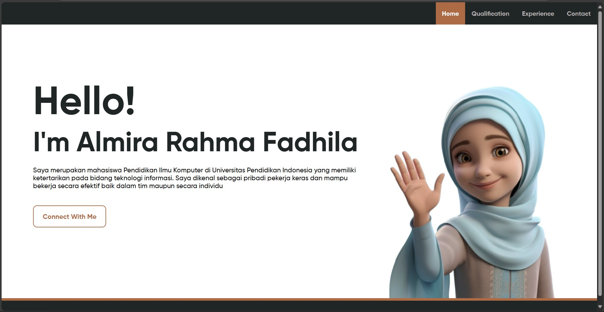
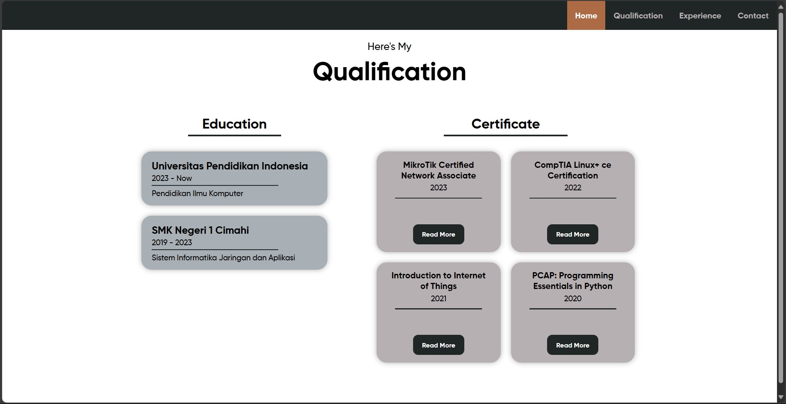
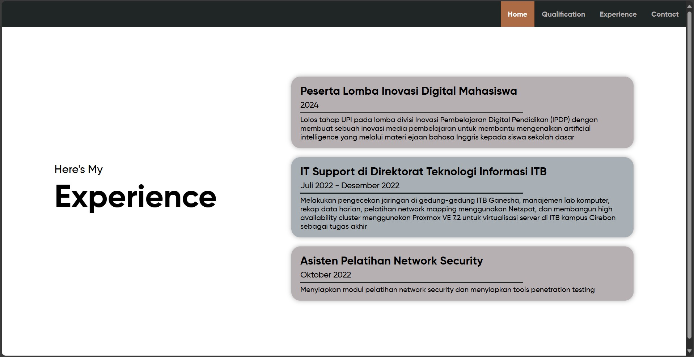
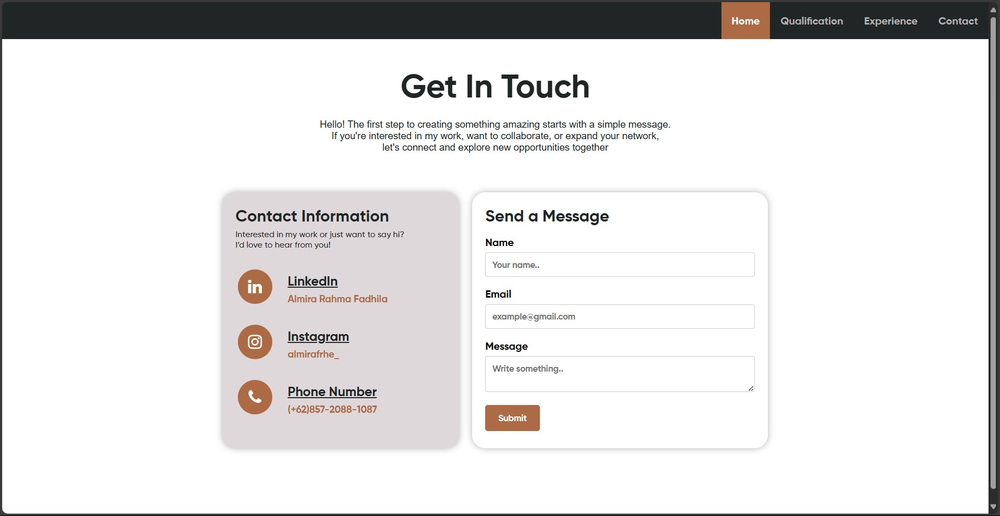

# Portofolio Menggunakan Django
Tugas Mata Kuliah Pemrograman Internet

## Instal Django
> **Note:** Pastikan sudah menginstal `Python` dan `PIP`.

- Buat folder/direktori project dan masuk ke folder project di CMD
```
cd [path direktori]
```
- Buat virtual environment dengan nama bebas (contoh: myworld)
```
py -m venv myworld
```
- Aktifkan virtual environment
```
myworld\Scripts\activate.bat
```
- Install django
```
py -m pip install Django
```
- Periksa versi django
```
django-admin --version
```
- Buat project django dengan nama bebas (contoh: myproject)
```
django-admin startproject myproject
```
- Masuk ke direktori project
```
cd [nama folder]
```
- Jalankan project django
```
py manage.py runserver
```

## Hasil
- Halaman profile

- Halaman qualification

- Halaman experience

- Halaman contact


## Dibuat Oleh
Nama: Almira Rahma Fadhila\
NIM: 2306308\
Program Studi: Pendidikan Ilmu Komputer